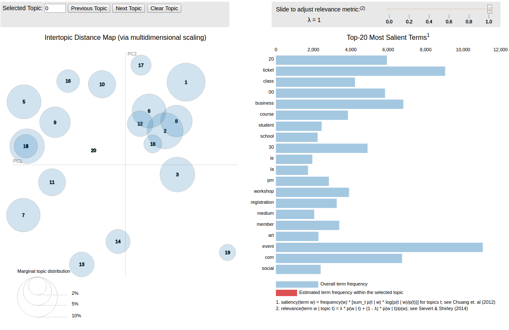

# Fraud Detector
This is a repository for a 2 day case study two of my classmates and I worked on during our Data Science Immersive at Galvanize.

## Intro
The data in this project came from a company that hosts events on their websites for users to purchase tickets. The goal was determine which of these events was fraud.

## Data
Their were 55 features in the original data set. Off the bat, we deleted 20 features which we believed contributed nothing or very little to the model. We then performed some data engineering. We created time_to_payout and time_till_event features by subtracting event_end from approx_payout_date and subtracting user_created from event_created respectively. The idea behind this was that fraudulent accounts may take awhile to pay after the event or may make an event immediately after creating the user name. We also created a boolean feature that states whether the event took place in the same country as the account was created in. We noticed many false values were fraudulent for that feature.

We also attempted to use Natural Language Processing (NLP) on the organization descriptions and event descriptions and create a new feature with the predict probabilities. However the predictions were very bad. Future attempts would be to use Latent Dirichlet Allocation (LDA) to separate the descriptions into topics and then predict which topic(s) may be fraudulent.

## Model
A fraud model was created using the class FraudClassifier in the fraud_model.py script. This model scales the data and uses a Random Forest Classifier. We measured our recall score to compare models and plotted the ROC curve which can be seen below.

We also created a profit curve to determine the percentage of test instances that returned the maximum profit.

## Web Application
A web application was created to better demonstrate how the fraud detector worked and the results. The application can be run by running the command `python app.py` and accessed by opening `http://0.0.0.0:8105` in your browser.

The home page of the web-site is below.

You can also predict on new data by going to the "Predict" tab and selecting "Predict" button. A page returning a event that was predicted to not be fraud is below. The description of the event along with the organization name and description is presented for the user. The data used for the prediction is stored on a Mongo database and can be accessed from the 'Predict' tab.  

The ROC and profit curves can be found in the 'Graphs' tabs. The 'Description Topics' will take you to a LDA visualization of the topics discussed in the descriptions as shown below. This allows the user to hover over each topic and see the top most salient terms. Example topics include, events, ticketing, art event, childrens event, etc. 

